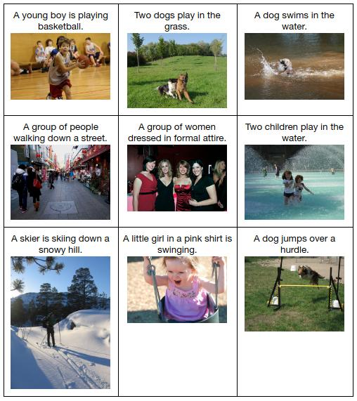

# Image Captioning in Keras

(**Note:** You can read an in-depth tutorial about the implementation in [this blogpost](https://daniel.lasiman.com/post/image-captioning "Building an Automated Image Captioning Application").)

This is an implementation of image captioning model based on [Vinyals et al.](https://arxiv.org/abs/1411.4555 "Show and Tell: A Neural Image Caption Generator") with a few differences:

  * For CNN we use Inception v3 instead of Inception v1.
  * For RNN we use multi-layered LSTM instead of single-layered one.
  * We don't have a special start-of-sentence word so we feed the first word at t = 1 instead of t = 2.
  * We use different values for some hyperparameters:

    | Hyperparameter     | Value     |
    | ------------------ | --------- |
    | Learning rate      |   0.00051 |
    | Batch size         |  32       |
    | Epochs             |  33       |
    | Dropout rate       |   0.22    |
    | Embedding size     | 300       |
    | LSTM output size   | 300       |
    | LSTM layers        |   3       |

## Examples of Captions Generated by the Proposed Model



## Evaluation Metrics

Quantitatively, the proposed model's performance is on par with Vinyals' model on Flickr8k dataset:

| Metric | Proposed Model | Vinyals' Model |
| ------ | -------------- | -------------- |
| BLEU-1 |      61.8      |       63       |
| BLEU-2 |      40.8      |       41       |
| BLEU-3 |      27.8      |       27       |
| BLEU-4 |      19.0      |      N/A       |
| METEOR |      21.5      |      N/A       |
| CIDEr  |      41.5      |      N/A       |

## Environment Setup

1. Download the dataset needed.
    ```shell
    ./scripts/download_dataset.sh
    ```

2. Download pretrained word vectors.
    ```shell
    ./scripts/download_pretrained_word_vectors.sh
    ```

3. Download pycocoevalcap data.
    ```shell
    ./scripts/download_pycocoevalcap_data.sh
    ```

4. Install the dependencies.

    Note: It was only tested on Python 2.7. It may need minor code changes to work on Python 3.

    ```shell
    # Optional: Create and activate your virtualenv / Conda environment

    pip install -r requirements.txt
    ```

5. Setup `PYTHONPATH`.
    ```shell
    source ./scripts/setup_pythonpath.sh
    ```

## Using a Pretrained Model

1. Download a pretrained model from [releases page](https://github.com/danieljl/keras-image-captioning/releases).

2. Copy `model-weights.hdf5` to `keras-image-captioning/results/flickr8k/final-model`.

3. Now you can run an inference from that checkpoint by executing a command below from `keras-image-captioning` directory:
    ```shell
    python -m keras_image_captioning.inference \
    --dataset-type test \
    --method beam_search \
    --beam-size 3 \
    --training-dir results/flickr8k/final-model
    ```

## Training from Scratch

### 1. Run a Training

For reproducing the model, execute:
```shell
python -m keras_image_captioning.training \
  --training-label repro-final-model \
  --from-training-dir results/flickr8k/final-model
```

There are many arguments available that you can look inside [`training.py`](keras_image_captioning/training.py).

### 2. Run an Inference and Evaluate It

```shell
python -m keras_image_captioning.inference \
  --dataset-type test \
  --method beam_search \
  --beam-size 3 \
  --training-dir var/flickr8k/training-results/repro-final-model
```

Note:
  * `dataset_type` can be either 'validation' or 'test'.
  * You can look the captions generated at `var/flickr8k/training-results/repro-final-model/test-predictions-3-20.yaml`. You can compare it with my result at `results/flickr8k/final-model/test-predictions-3-20.yaml`.

## License
MIT License. See LICENSE file for details.
